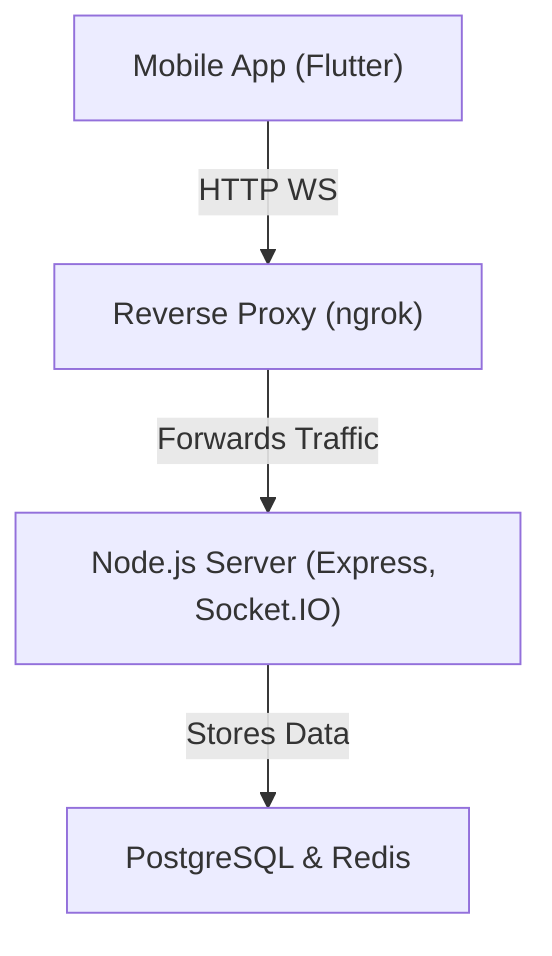
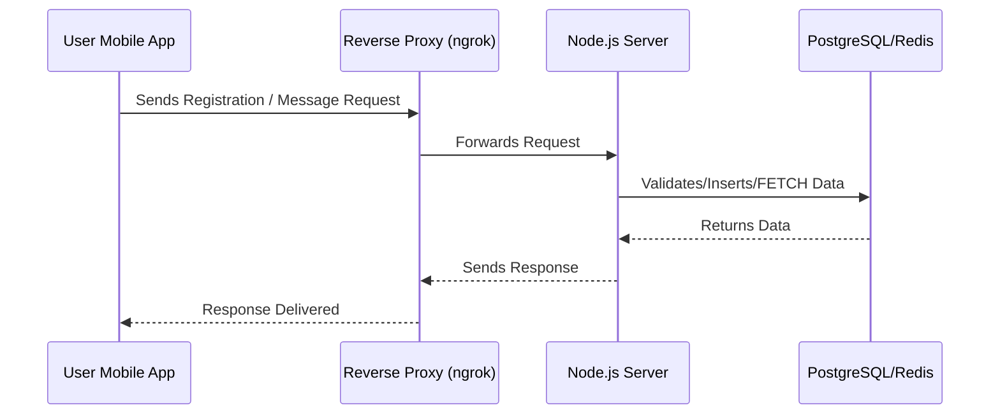

# Project Overview: flight - Real-Time Messaging App

This document provides a comprehensive overview of the application. The app supports real-time, private conversations with features such as message replies and dynamic public IP updates. The project overcomes CGNAT and dynamic IP challenges by exposing the local server via reverse proxy solutions (e.g., ngrok) and uses robust backend and frontend technologies. Deployment is managed using Terraform.

---
Red Background

---
## Table of Contents

1. [Introduction](#introduction)
2. [Technologies Used](#technologies-used)
3. [Security Measures](#security-measures)
4. [Architecture & Design](#architecture--design)
    - [High-Level Architecture](#high-level-architecture)
    - [Data Flow Diagram](#data-flow-diagram)
5. [Deployment with Terraform](#deployment-with-terraform)
6. [Conclusion](#conclusion)

---

## Introduction

The private messaging application is designed for real-time, secure communication between users, similar to WhatsApp. Users register with a chosen username, and conversations are private between the involved parties. Message replies are supported with clear visual context for both sender and receiver. The project addresses challenges like dynamic public IPs and CGNAT by using a reverse proxy (ngrok) and an automated IP update mechanism.

---

## Technologies Used

| **Layer**          | **Technology/Tool**                            | **Description**                                                        |
|--------------------|------------------------------------------------|------------------------------------------------------------------------|
| **Backend**        | Node.js, Express, Socket.IO                    | REST API and WebSocket server for real-time messaging                  |
|                    | PostgreSQL                                     | Database for storing user, conversation, and message data               |
|                    | Redis                                          | In-memory cache for fast lookups and session management                  |
|                    | Winston                                        | Logging framework for tracking server events and errors                  |
| **Frontend**       | Flutter                                        | Cross-platform mobile framework for building the UI                     |
|                    | socket_io_client                               | Flutter package to connect to Socket.IO for real-time messaging          |
|                    | http, shared_preferences                       | HTTP communication and local storage for persistent settings             |
| **Reverse Proxy**  | ngrok                                          | Exposes local server behind CGNAT/dynamic IP to a public URL               |
| **Deployment**     | Terraform                                      | Infrastructure-as-code tool to provision on-prem resources                  |

---

## Security Measures

| **Security Aspect**       | **Implementation Details**                                                                                   |
|---------------------------|---------------------------------------------------------------------------------------------------------------|
| **Transport Security**    | TLS/SSL used on reverse proxy (via ngrok or Nginx) to encrypt communications                                   |
| **Authentication**        | User registration with manual username; further JWT authentication can be integrated if needed                  |
| **Data Encryption**       | End-to-end encryption support via RSA-based methods in Node.js (using the built-in `crypto` module)               |
| **Input Validation**      | Server-side input validation on API endpoints to mitigate injection attacks                                      |
| **Firewall & NAT**        | Proper configuration using UFW/iptables to allow necessary ports and ensure port forwarding from the router        |
| **Logging & Monitoring**  | Winston logs critical events and errors; logs are accessible securely via a dedicated endpoint (/logs)             |
| **Dynamic IP Handling**   | A dedicated endpoint (/ip) reads the public IP from a file and updates the app automatically every 5 minutes        |

---

## Architecture & Design

### High-Level Architecture

---

### DataFlow Diagram

